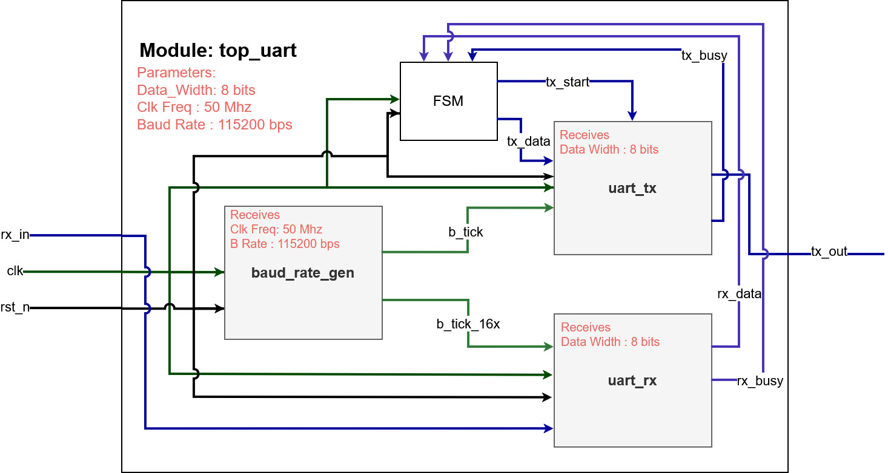

# UART Receiver Integrity

## 16x Oversampling

- Capturing asynchronous, clock-less signals requires synchronization.
- The RX baud generator runs 16 times faster than the actual baud rate.
- High-frequency sampling filters out voltage transients and glitches shorter than a bit period.

## Center Sampling

- The receiver detects the START edge, waits 8 tick cycles, and samples exactly in the temporal middle of the bit, where the signal voltage is at its most stable.

## UART Module Block Diagram

- This module shows all the connections we make regarding wires within the top module of our UART design.
- Timing wires are drawn with dark green, data wires are drawn with king blue, and the rst_n wire is drawn with black.
- Parameters written in the top module and received by each instantiation of the other submodules are in red.
- Diagram here: 

## Git Version Control

- Purpose: Git provides local version control via frozen snapshots (commits) of the project. GitHub provides remote backup and collaboration.
- Key Bash commands:
	- `git add`: Stage changes.
	- `git commit -m`: Commit to local repo.
	- `git push` / `git pull`: Sync with remote.
	- `git branch` / `git checkout`: Manage and switch branches.
- Gitflow branches: `main`, `hotfix`, `release`, `develop`, `feature`.
- Features are built independently and merged into the main line upon completion.