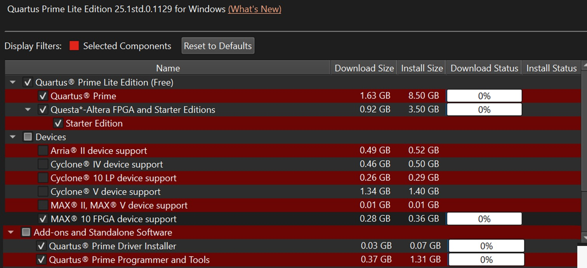
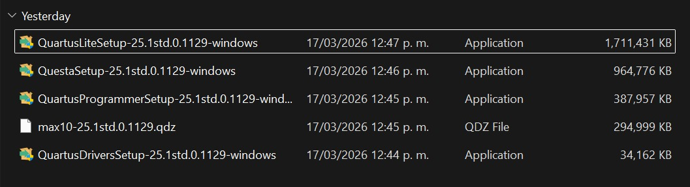
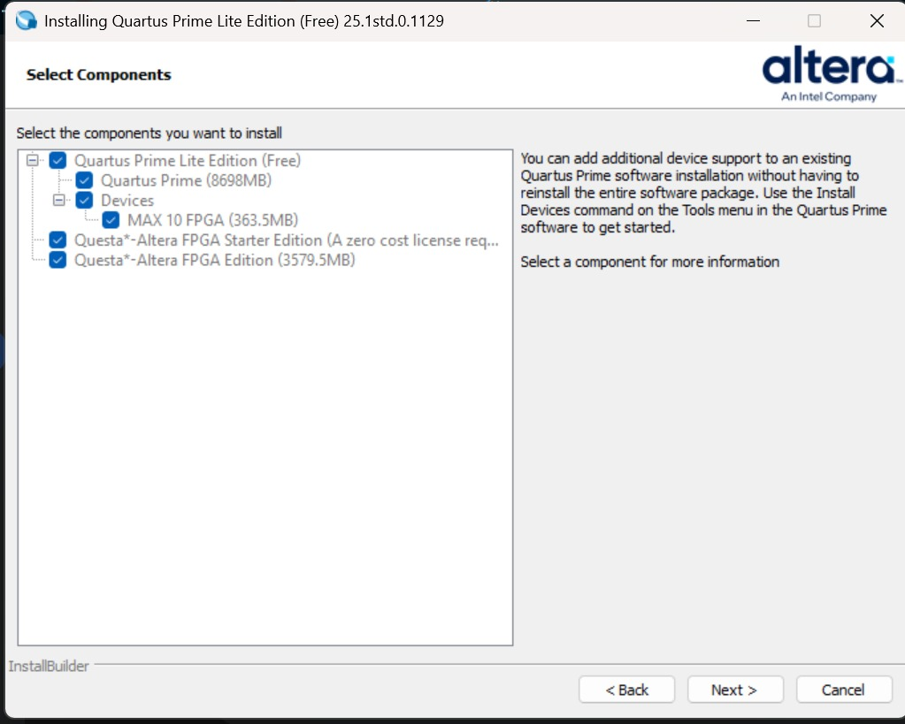

# Intel Quartus Prime Lite Edition 25.1 Installation Guide

Follow these steps to ensure your development environment is correctly configured for the **DE10-Lite (MAX 10)** FPGA board.

### Step 0: Download Link
Download the installer directly from the Intel FPGA Self-Service Portal:
🔗 [Intel Quartus Prime Lite Edition v25.1 - Windows](https://www.intel.la/content/www/xl/es/software-kit/868561/intel-quartus-prime-lite-edition-design-software-version-25-1-for-windows.html)

### Step 1: Component Selection
Run the initial downloader. When prompted, you must select the following components:
* **Quartus Prime Lite Edition**
* **MAX 10 FPGA Device Support** (Mandatory for our hardware)
* **Quartus Prime Programmer and Tools**

### Step 2: Verify Downloaded Files
Before running the main setup, ensure all modular files (specifically the `.qdz` device files) are located in the **same folder**. The master installer requires these to be in the same directory to perform a complete installation.

### Step 3: Run the Master Setup
Execute `QuartusLiteSetup-25.1std.0.1129-windows`. The wizard will automatically handle the installation of the Programmer and the MAX 10 support.

### Step 4: USB-Blaster Driver Installation
Once the main installation is complete, the **Driver Installation Wizard** will launch. 
1. Accept the installation of the **"Intel FPGA Download Cable"** (USB-Blaster).
2. Connect your DE10-Lite board.
3. Verify in **Windows Device Manager** that the device appears correctly under USB controllers.

### Step 5: Creating Your First Project
For a step-by-step guide on starting your first RTL project, refer to the following PDF in the resources folder:
📄 [QuartusI-MODELSIMI-BriefTutorial.pdf](./)