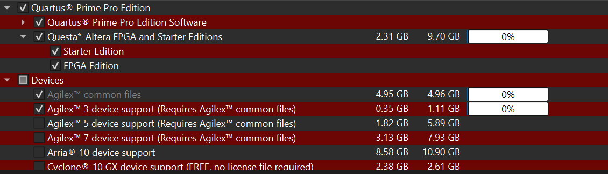
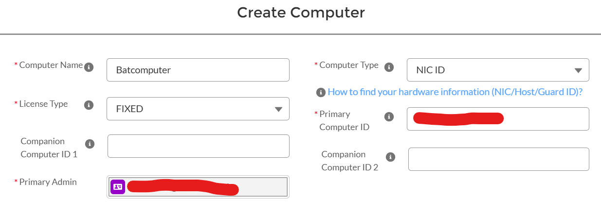
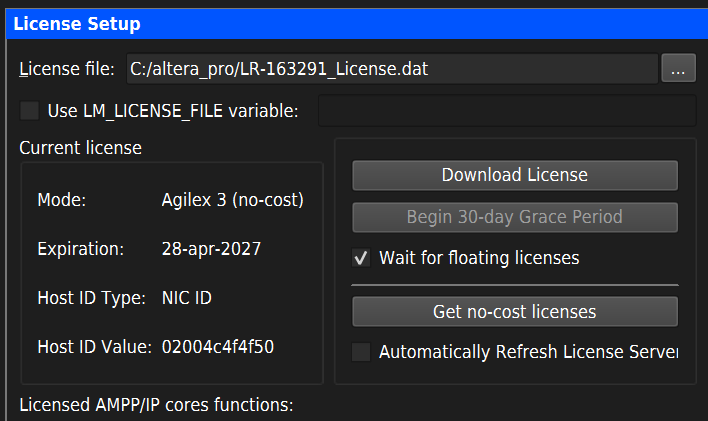

# Intel Quartus Prime Pro Edition Installation & Licensing Guide

Follow these steps to ensure your development environment is correctly configured for the **Agilex 3** FPGA board. Unlike the Lite edition, Quartus Prime Pro requires a specific installation and a hardware-linked license to operate.

### Step 1: Component Selection and Installation
Run the Quartus Prime Pro installer. Because Agilex architectures require advanced routing algorithms, the software size is significantly larger. When prompted by the installation wizard, you must select the following components:
* **Quartus Prime Pro Edition Software**
* **Questa-Altera FPGA and Starter Editions**
* **Agilex 3 device support** 
* **Drivers**

### Step 2: Requesting the Agilex 3 License
The Pro edition requires a Node-Locked (Fixed) license. Altera provides a no-cost enablement license for Agilex 3 C-Series development kits.

1. Open a command prompt (`cmd`) and execute `ipconfig /all` to find your Network Interface Card (NIC) Physical Address (MAC address). Note this 12-digit alphanumeric string without hyphens (e.g., `000C29584BD1`).
2. Navigate to the Altera Self-Service License Center: 🔗 [https://www.altera.com/SSLC](https://www.altera.com/SSLC)
3. Under the "Sign up for Evaluation or No-Cost Licenses" section, locate and select the row corresponding to **Agilex™ 3 C-Series FPGA Software Enablement (License: SW-AGILEX-3)**.
4. Set the Computer Type to **NIC ID** and input your 12-digit MAC address into the **Primary Computer ID** field. 
5. Select **FIXED** for the License Type and click Generate.

The automated system will generate the license and email the `.dat` file to you. This process typically should be completed within 10 minutes.

### Step 3: Configuring the License in Quartus Pro
Once you receive the `.dat` license file via email, save it to a secure, permanent directory on your machine (e.g., `C:\altera_pro\licenses\`).

1. Launch Quartus Prime Pro Edition.
2. If the software prompts you for a license upon startup, select the option to specify a valid license file.
3. If it opens directly to the main interface, navigate to **Tools > License Setup**.
4. In the "License file" field, browse to and select your downloaded `.dat` file. The system should immediately populate the "Licensed AMPS features" and "Licensed IP cores" tables, confirming the software is unlocked for Agilex 3 development.

